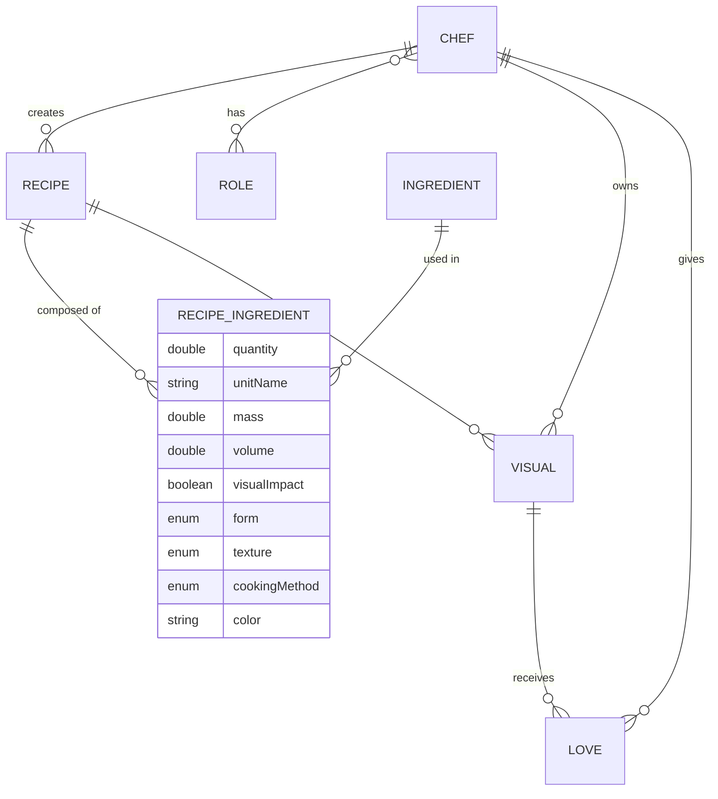
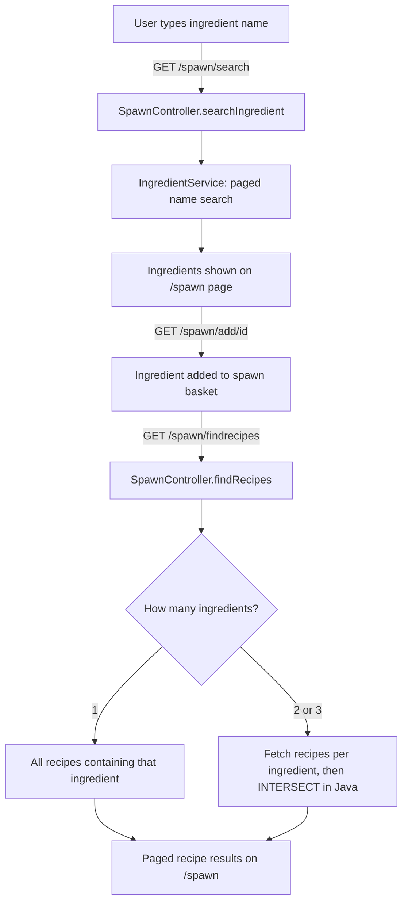
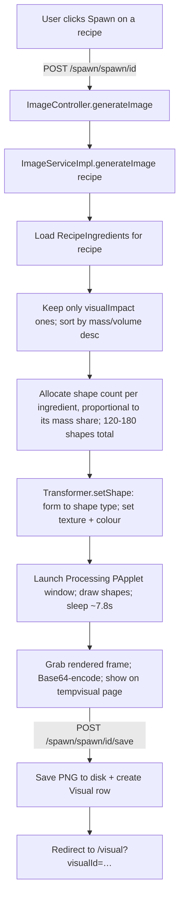

# DishSpawn — High-Level Functional Overview

> **Document status:** Step 1 deliverable — a functional + architectural map of the
> application *as it exists today*. It describes **what the app does and how the pieces
> fit together**, not (yet) how to improve it. Improvement opportunities are deliberately
> deferred to the Step 2 document.
>
> Written by reading the source directly (branch `testLint`). Where the code and the
> intent diverge, this document reports the *actual* behaviour and flags it.

---

## 1. Purpose & Vision

DishSpawn is a **Spring Boot web application** with two intertwined goals:

1. **Recipe discovery by ingredient.** A user enters 1–3 ingredients; the app returns the
   recipes that contain **all** of those ingredients (a set-intersection search).
2. **Generative art from a recipe.** When a recipe is selected, the app *spawns* an
   abstract image whose visual parameters (shape, colour, quantity of shapes, texture)
   are **derived from that recipe's ingredients**.

The project began as a Java EE course capstone and is being actively evolved. Its
signature idea — and the thing worth protecting as it grows — is the **bridge between the
culinary domain and the visual domain**: the very same data that describes *how an
ingredient appears in a dish* (its form, texture, colour, amount) is what drives the
drawing.

---

## 2. Technology Stack

| Concern | Choice |
|---|---|
| Language / platform | **Java 19** |
| Framework | **Spring Boot 2.7.5** (Spring MVC, Spring Data JPA, Spring Security) |
| View layer | **Thymeleaf** server-side templates (`WEB-INF/templates`) + a little REST/JS |
| Front-end assets | **UIkit** CSS/JS, **p5.js** (present in `static/js`), custom `master.css`/`master.js` |
| Persistence | **MySQL** via `mysql-connector-j`, Hibernate/JPA |
| Generative graphics | **Processing 4 core** (`processing-core-4`, via JitPack) |
| Boilerplate reduction | **Lombok** |
| Build | **Maven** (with `mvnw` wrapper) |

Two Maven profiles exist: `local` (adds Spring DevTools) and `prod` (active by default).
Configuration lives in `application.properties` + `application-local.properties` +
`application-prod.properties`.

---

## 3. Actors & Roles

Users are modelled as **`Chef`**s. Authorisation is role-based (Spring Security), with a
role hierarchy expressed through URL rules:

| Role | Can do (per `SecurityConfiguration`) |
|---|---|
| *anonymous* (not logged in) | Browse home, search, view recipes & visuals, log in/register |
| **chef** | + add recipes, "love" a visual |
| **superchef** | + add ingredients |
| **admin** | + all `/api/**` endpoints and the `/all` listing pages |

Note: authorisation is enforced almost entirely by **URL pattern matching** in one
`SecurityFilterChain`, not by method-level annotations.

---

## 4. Core Domain Concepts (the app's vocabulary)

Everything in the app is expressed in terms of these seven entities.

| Entity | Meaning | Notable fields |
|---|---|---|
| **Chef** | A user account | username (unique), password, email, avatar, roles, `dailySlot` |
| **Recipe** | A dish | name, ordered `instructions` (list of strings), owning chef |
| **Ingredient** | A pantry item (catalogue entry) | name (**unique**), `IngredientCategory` |
| **RecipeIngredient** | **The heart of the model** — the join between a Recipe and an Ingredient, *enriched* with cooking + visual data | quantity, unit, mass, volume, `visualImpact`, `form`, `texture`, `cookingMethod`, `color` |
| **Visual** | A pointer to one generated image (metadata in DB, PNG on disk) | fileName, fileLocation, owning recipe + chef, `loveCount`, transient `userLove` |
| **Love** | A "like" of a Visual by a Chef | visual, chef |
| **Role** | A security role | name |

### 4.1 Why `RecipeIngredient` is the keystone

`RecipeIngredient` is not a plain link row. It is where the two halves of the application
meet. When a recipe says *"200 g of diced, firm, roasted, red tomato"*, that single row
carries:

- the **quantity + unit** → converted into a normalised **mass or volume**
  (via `MassConverter` / `VolumeConverter`),
- **`form`** (e.g. `DICED`, `SLICED`, `SPHERES`) → drives **which shape** is drawn,
- **`texture`** (e.g. `CRUNCHY`, `CREAMY`) → drives **how the shape is rendered** (stroke/fill/opacity),
- **`color`** (hex string) → drives the **shape colour**,
- **`visualImpact`** (boolean) → whether this ingredient participates in the drawing at all.

So the search feature reads the *ingredient* side of this row, and the art feature reads
the *visual-property* side. Same table, two audiences.

### 4.2 The "visual vocabulary" enums

These controlled vocabularies (in `model/util/visualproperties`) are the translation
dictionary between food and image:

- **`IngredientCategory`** (~39 values): `DAIRY_CHEESE`, `FRUITS_CITRUS`, `VEGETABLES_ROOT`, `MEAT`, `SPICES`, … Currently taxonomic metadata; **not yet used** by the drawing algorithm.
- **`RecipeIngredientForm`** (27 values): `BEANS, BLOBS, CHOPPED, CONFETTI, CRUMBS, CRUSHED, CUBES, CURLS, DICED, ECCENTRIC, EGG_LIKE, FLUID, GRANULES, LEAVES, MASHED, PANCAKE, PIECE, POWDER, RINGS, SHEETS, SHELLS, SHREDDED, SMASHED, SLICED, SPHERES, STRINGS, WEDGES`. → mapped to a shape by `Transformer`.
- **`RecipeIngredientTexture`** (10 values): `BREADY, CHEWY, CREAMY, CRUNCHY, FIRM, MOIST, OILY, PASTY, POWDERY, WATERY`. → mapped to a render style by `Shape.applyTextureStyle()`.
- **`RecipeIngredientCookingMethod`** (19 values): `ADD, BAKE, BOIL, BROIL, BRAISE, DRIZZLE, GARNISH, GRILL, MELT, MIX, POACH, ROAST, SAUTE, SIMMER, SPRINKLE, STEAM, STEW, STIR`. Captured on each row but **not yet used** by the drawing algorithm.

### 4.3 Entity-relationship map



---

## 5. Feature Catalogue (what a user can do)

Grouped by area, with the controller + primary route.

### Discovery & Spawning (the two headline features)
| Feature | Route | Controller |
|---|---|---|
| Spawn page (ingredient picker + results) | `GET /spawn` | `SpawnController` |
| Search the ingredient catalogue | `GET /spawn/search?searchKey=…` | `SpawnController` |
| Add an ingredient to the "spawn basket" | `GET /spawn/add/{id}` | `SpawnController` |
| **Find recipes containing all chosen ingredients** | `GET /spawn/findrecipes` | `SpawnController` |
| Reset the basket | `GET /spawn/reset` | `SpawnController` |
| **Generate a visual for a recipe** | `POST /spawn/spawn/{id}` | `ImageController` |
| Save the generated visual | `POST /spawn/spawn/{id}/save` | `ImageController` |
| View a saved visual | `GET /visual?visualId=…` | `VisualController` |
| "Love" a visual | `GET /visual/{visualId}/love` | `LoveController` |

### General text search (separate from the ingredient search)
| Feature | Route | Controller |
|---|---|---|
| Search recipes & chefs by name | `GET /search?searchKey=…` | `SearchController` |

### Content management (CRUD)
| Feature | Route | Controller |
|---|---|---|
| Home / gallery | `GET /home` | `HomeController` |
| List / view / add / save recipes | `GET /recipe`, `/recipe/all`, `/recipe/add`, `POST /recipe/save` | `RecipeController` |
| List / add / save ingredients | `GET /ingredient/all`, `/ingredient/add`, `POST /ingredient/save` | `IngredientController` |

### Accounts & auth
| Feature | Route | Controller |
|---|---|---|
| Register a chef | `GET /chef/create`, `POST /chef/create` | `ChefController` |
| List chefs / view a chef profile | `GET /chef/all`, `GET /chef/{chefId}` | `ChefController` |
| Login page | `GET /login` | `LoginController` |

### REST API (admin-only)
`/api/chef/**`, `/api/recipe/all`, `/api/ingredient/all`, `/api/visual/all` — JSON
listings behind the `admin` role. These appear to be diagnostic/administrative rather
than a public API.

---

## 6. The Two Signature Flows in Detail

### 6.1 Flow A — Find recipes by ingredients (Goal 1)



**How the intersection actually works today:** for each chosen ingredient,
`SpawnController` asks `RecipeIngredientService` for every `RecipeIngredient` that uses
that ingredient, maps each to its `Recipe`, and then computes the **intersection of those
recipe lists in memory** (`stream().filter(list2::contains)`). There is a separate
explicit branch for 1, 2, and 3 ingredients. There is **no database query** that does
"find recipes containing all N ingredients" — the join/intersection happens in Java.

> This design is functionally correct for a small catalogue but is the single most
> important thing to revisit for **Step 3** (scaling to thousands of recipes). Noted here,
> analysed there.

### 6.2 Flow B — Spawn a generative visual (Goal 2)



**The generative algorithm, step by step (`ImageServiceImpl` + `Transformer` + `Shape`):**

1. Fetch the recipe's `RecipeIngredient`s; keep those with `visualImpact == true` and a
   positive mass/volume; sort them **largest-mass-first**.
2. Pick a total shape budget: a random number **between 120 and 180**.
3. Give each ingredient a share of that budget **proportional to its mass fraction**
   (a bigger ingredient → more shapes).
4. For each shape, `Transformer.setShape` maps the ingredient's **`form`** to one of four
   shape classes — **`Ellipse`, `Circle`, `Triangle`, `Rectangle`** (`Shape` subclasses) —
   and attaches the ingredient's **`texture`**.
5. The shape's **colour** = the ingredient's hex colour + a random alpha (opacity).
6. Each shape is positioned via `Shape.step()` and rendered per its texture style
   (`applyTextureStyle` chooses stroke/fill/opacity from the texture enum).
7. The Processing sketch (`TheSketch`) draws one shape per frame until all are drawn.
8. After a fixed **`Thread.sleep(7777)`**, the frame is captured, Base64-encoded, and
   returned to the `tempvisual` view for preview.
9. On save, the `PImage` is written to `src/main/webapp/spawns/visualN.png` and a `Visual`
   row is persisted (linked to the recipe and the logged-in chef).

**Supporting graphics classes:**
- `TheSketch` — the Processing `PApplet` (the canvas + draw loop), 800×800.
- `Shape` (abstract) + `Circle`/`Ellipse`/`Triangle`/`Rectangle` — the drawable primitives.
- `Transformer` — form → shape mapping (pure function).
- `Randomizer`, `MoveIt`, `PositionIt`, `ColorizeIt` — helpers/interfaces for motion & colour.
- `SketchThread` — a thread wrapper that can launch a sketch (see gaps below).
- `graphics/vanillajava/*` (`Ball`, `ImageCanvas`, `ImageWindow`) — an **earlier,
  non-Processing** graphics experiment, effectively legacy.

---

## 7. Application Architecture

Classic layered Spring MVC. Dependencies point downward; each layer talks only to the one
below it.

```
Browser  ──HTTP──►  Controllers (MVC @Controller + REST @RestController)
                        │  (also: SecurityFilterChain, error/exception handlers)
                        ▼
                    Services (interface in service/, logic in service/implementation/)
                        │
                        ▼
                    Repositories (Spring Data JPA)
                        │
                        ▼
                    MySQL   ◄──►  JPA/Hibernate entities (model/)

Cross-cutting: security/ (Spring Security adapters), graphics/ (Processing engine),
model/util/ (unit conversion + visual-property enums)
```

**Package tour:**

| Package | Role |
|---|---|
| `controller/` | MVC controllers returning Thymeleaf view names |
| `controller/rest/` | JSON REST controllers (`/api/**`) |
| `controller/utils/` | `Parser`, `ListSkipper` helpers |
| `service/` + `service/implementation/` | Business logic (interface + impl split) |
| `repository/` | Spring Data JPA repositories |
| `model/` | JPA entities + one DTO (`RecipeIngredientCreationDto`) |
| `model/util/unitconversion/` | Mass/volume unit converters |
| `model/util/visualproperties/` | The form/texture/category/cooking-method enums |
| `security/` | `SecurityChef`, `SecurityRole` (UserDetails adapters) |
| `config/` | `SecurityConfiguration` |
| `error/` + `exception/` | Error controller, `@ControllerAdvice`, custom exceptions |
| `graphics/processing/` | Processing-based generative engine (the live one) |
| `graphics/vanillajava/` | Legacy non-Processing graphics experiment |
| `web/` | Form-backing objects (`FormCreateChef`, `FormLoginChef`) |
| `play/` | **Scratch/experimental code shipped inside `src/main`** (`PlaySketch`, `TestJDBC`, `BallOld`, …) |

**Views:** Thymeleaf templates in `src/main/webapp/WEB-INF/templates/` — including
`home`, `spawn-i`, `search-result`, `recipe`, `visual`, `tempvisual`, `add-recipe`,
`add-ingredient`, `add-chef`, `login`, reusable `fragments/` (header, subheader, alerts,
login-form), and `error/` pages (403/404/405/409/5xx).

**Generated output:** `src/main/webapp/spawns/` holds 150 committed `visualN.png` files —
i.e. generated artefacts currently live **inside the source tree** and in version control.

---

## 8. Security Model (as configured)

- A single `SecurityFilterChain` with **URL-pattern** authorisation (see §3 for the role
  matrix).
- **CSRF is enabled** (default).
- Passwords are hashed with Spring's **delegating `PasswordEncoder`** (bcrypt-family by
  default).
- Form login at `/login`; success → `/home`; logout clears `JSESSIONID`.
- `SecurityChef` / `SecurityRole` adapt the `Chef`/`Role` entities to Spring Security's
  `UserDetails`.

---

## 9. Current State & Known Functional Gaps

Reported as **facts about today's behaviour** (the deeper "how to improve" analysis is
Step 2). These are the places where intent and implementation don't yet fully meet:

1. **Complementary-background feature is half-wired.** `TheSketch` can set the background
   to the *complementary* colour of a "dominant ingredient colour"
   (`setComplementaryBackground`), but `setDominantIngredientColor(...)` is **never called**
   anywhere, so in practice the background falls back to a **random RGB** colour.
2. **Shape positioning is effectively random, not flow-based.** `Shape.movePerlinNoiseWithinFrame()`
   samples Perlin noise at a *random* offset per shape and discards the incremented offset
   (it's a local variable), so shapes land at random positions rather than along a coherent
   noise field. The intended "layers relate to each other" idea (see `Transformer`'s notes)
   is not yet realised.
3. **`cookingMethod` and `IngredientCategory` are captured but unused** by the drawing.
   The vocabulary is richer than the algorithm currently consumes.
4. **Rendering is desktop-bound.** Image generation forces `java.awt.headless=false` and
   opens a real Processing window, then blocks the request thread for ~7.8 seconds. This
   works on a developer's desktop but is not a headless-server-friendly design.
5. **Data is entered manually.** There is no seed script (`data.sql`) or bulk import; the
   recipe/ingredient catalogue is populated through the add-forms. The README notes the
   catalogue is currently small (recipes sourced from one website). This is the starting
   point for **Step 3** (mass-populating the database).
6. **Request-scoped state is held on singleton beans — and it's more than it first
   looks.** `SpawnController` is a default-scoped (singleton) `@Controller` carrying
   **seven** mutable instance fields as request state: three lists (`ingredientSpawnList`,
   `recipeSpawnList`, `ingredientListPage`), two paging counters, two result totals, a
   `findRecipeMethodIsUsed` flag, and message `StringBuilder`s. `ImageController` holds the
   "recipe being generated" the same way. This works for one chef at a time; with two chefs
   searching concurrently, each request writes into the *same* shared fields, so one chef's
   search/paging state can bleed into another's. This reads as a real concurrency bug, not
   just a design smell — worth treating as such in Step 2, not merely noting.
7. **Legacy/scratch code remains in the main source tree** (`graphics/vanillajava/`,
   `play/`), which blurs what is "the app" vs. "experiments."
8. **Test coverage is effectively absent.** The project has exactly one test file,
   `DishSpawnApplicationTests.java`, containing only the default Spring Boot `contextLoads()`
   smoke test. There are no unit tests for services (search intersection, image generation)
   and no integration tests for controllers. This is a starting point for the "testing" axis
   of Step 2.

---

## 10. How this maps to the multi-session roadmap

| Session goal | Where this document points |
|---|---|
| **1. Functional analysis** *(this doc)* | ✅ complete |
| **2. Improvement opportunities** | §6.1 (search design), §7 (layering, singleton state), §9 (all gaps), plus efficiency/security/testing to be analysed fresh |
| **3. Grow the recipe/ingredient database** | §5 (manual entry today), §6.1 (in-memory intersection), §9.5 (no seed data) |
| **4. Improve the generative image** | §4.2 (unused vocabulary), §6.2 (the algorithm), §9.1–9.3 (half-wired features) |
| **5. Introduce Clojure for the generative part** | §6.2 boundary (`ImageServiceImpl` → `Transformer` → `Shape`/`TheSketch`) is the natural seam to reimplement |

---

*End of Step 1 document.*
