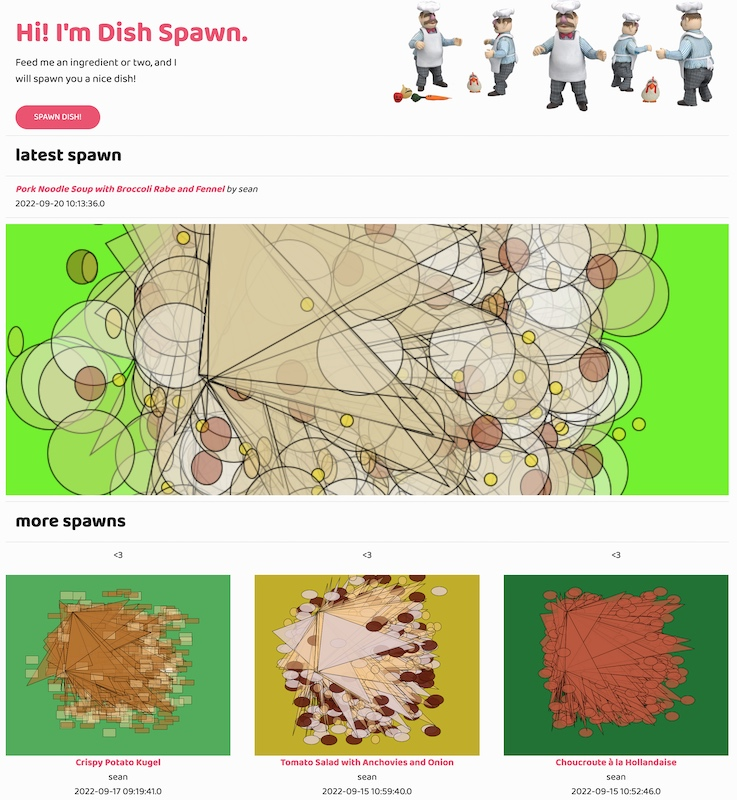
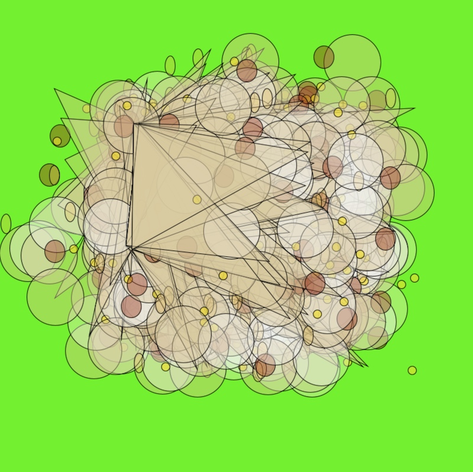

# DishSpawn
DishSpawn is a small Java web application which I built as my 
end-project of the 1-year Java EE Development course @Intec. 

DishSpawn has 2 main goals:
1. provide dish-spawn with a few ingredients as input and get suggestions for 
   recipes as output.
>> Suggested recipes are a subset containing all ingredients provided.
2. generate an (abstract) image belonging to the suggested recipe.
>> Image parameters are derived from the ingredients in the suggested recipe.

It is inspired by generative art and cooking.

The application is built in Spring Boot, as an MVC pattern, with Thymeleaf 
for views and a (currently) local MySQL database for storage.

For generating images, Processing 4 core is used as library, with help from 
[this Github's repo](https://github.com/micycle1/processing-core-4).
Maven is used to support all dependencies.

For the few recipes the app currently contains, I used [Alison Roman's 
website](https://www.alisoneroman.com/recipes).

Although the app is considered finished as an end-project for the course, the 
app is still in progress. Open points:
- Issue - after generating the image, the Processing engine stops, which 
  also stops the app - obviously the app needs to remain running -> needs a fix.
- Issue - after generating the image, the newly spawned image is not shown 
  in the browser - needs a fix (caching-issue?).
- Spring Security implementation
- Multithreading
- Algorithm to generate image is premature - yes, dependent on ingredients, 
  but very basic. Needs much more development (which is the real fun!)
- Lots of little lay-out thingies to be improved.

## Screenshots

Home

Zoom image

Recipe finder

Recipe and visual view

Oh and yes, the action figure from the Swedish Chef you can find [here](https://www.amazon.com/DIAMOND-SELECT-TOYS-Muppets-Swedish/dp/B06XGHJQ6L).

<3 Erik